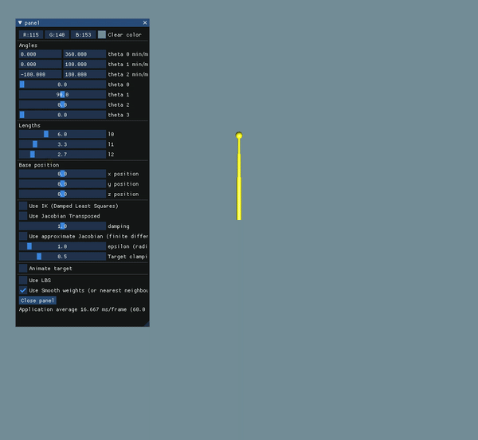
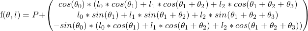
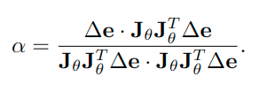
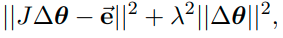
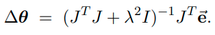
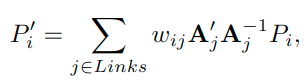
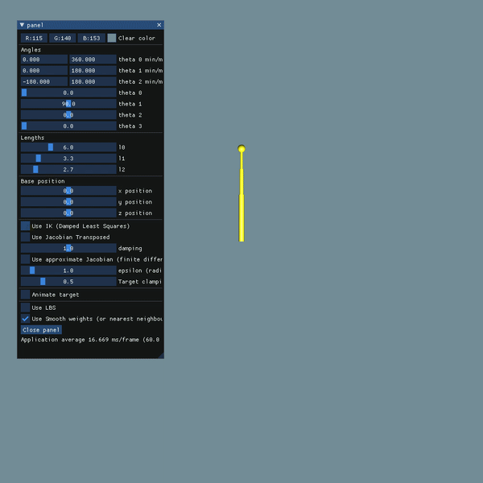

Inverse Kinematics
-------------

This is the third assignment of CPSC 687 (Animation) course, held in winter 2022 at the 
University of Calgary. In this assignment, I implemented inverse kinematic for an articulated structure with **4 degrees
of freedom** using two different methods, **Jacobian transpose** and **damped least squares**.
Also, I implemented skinning for it with predefined weights. 

## Adding 3rd bone

The template code had 2 bones and 3 degrees of freedom itself. My first task was to change it to have 4 degrees of freedom.
In this order, I have added on bone with a joint with one degree of freedom (An angle same is `Theta1` and `Theta2`).

For this, I have changed some structures of `SingleArm` class. 
First, I changed all structures interacting with angles from `vec3f` to `vec4f` as we have 4 different angles. 
Second, I added the M_2 method for applying the last bone effect on the endpoint.

I have also added different components to panel UI to control the 3rd bone completely.



First output after adding the 3rd bone.

## Calculating the Jacobian matrix

The next part for implementing the assignment, was to calculate the jacobian matrix in each frame and position.
As the explicit forward kinematics formula for this articulated structure was easy to calculate, I easily wrote a function
to calculate the Jacobian matrix.

The explicit forward kinematic formula for this structure is as bellow.



Which `P` is the root position, `theta` is the angles and `l` is the lengths of the bones.

Based on this formula, it's easy to calculate the jacobian matrix. I did it as bellow.

```c++
jacobian_matrix J = (Eigen::MatrixXf(3, 4) <<
    // x
    -sin(t0) * (l0 * cos(t1) + l1 * cos(t1 + t2) + l2 * cos(t1 + t2 + t3)),
    cos(t0) * (l0 * -sin(t1) + l1 * -sin(t1 + t2) + l2 * -sin(t1 + t2 + t3)),
    cos(t0) * (l1 * -sin(t1 + t2) + l2 * -sin(t1 + t2 + t3)),
    cos(t0) * (l2 * -sin(t1 + t2 + t3)),
    // y
    0.f,
    l0 * cos(t1) + l1 * cos(t1 + t2) + l2 * cos(t1 + t2 + t3),
    l1 * cos(t1 + t2) + l2 * cos(t1 + t2 + t3),
    l2 * cos(t1 + t2 + t3),
    // z
    -cos(t0) * (l0 * cos(t1) + l1 * cos(t1 + t2) + l2 * cos(t1 + t2 + t3)),
    -sin(t0) * (l0 * -sin(t1) + l1 * -sin(t1 + t2) + l2 * -sin(t1 + t2 + t3)),
    -sin(t0) * (l1 * -sin(t1 + t2) + l2 * -sin(t1 + t2 + t3)),
    -sin(t0) * (l2 * -sin(t1 + t2 + t3))
).finished();
```

## Jacobian transpose method

After calculating jacobian matrix, we can use it in Jacobian transpose method. 
For this method, in each step, we should calculate `deltaTheta` based on this matrix. 

For calculating this value, first, we should calculate `alpha` variable. 



* I calculated `Jt` with `.transpose()` method of eigen library.

And the `deltaTheta` is calculated as bellow.

```c++
SimpleArm::joint_angles solveDeltaTheta_JacobianTranspose(SimpleArm::jacobian_matrix const &J, vec3f const &deltaE) {
    eigen_tools::eigen_vec3f deltaE_eigen = eigen_tools::toEigen(deltaE);
    transposed_jacobian_matrix Jt = J.transpose();
    auto alpha = deltaE_eigen.dot(J * Jt * deltaE_eigen) / (J * Jt * deltaE_eigen).dot(J * Jt * deltaE_eigen);
    eigen_tools::eigen_vec4f deltaTheta = alpha * (Jt * deltaE_eigen);
    return SimpleArm::joint_angles(deltaTheta);
}
```

# Damped Least Squares method

The other method for calculating `deltaTheta` is to use Damped least squares method. 
This method will minimize the value 



where lambda is a non-zero damping constant. 

Based on the equations in [2], the `deltaTheta` calculated based on this formula.



* The last parameter (e with the flash) is `deltaE`.

The calculating function is as bellow.

```c++
    SimpleArm::joint_angles solveDeltaTheta_DampedLeastSquares(SimpleArm::jacobian_matrix const &J, vec3f const &deltaE, float damping) {
        eigen_tools::eigen_vec3f deltaE_eigen = eigen_tools::toEigen(deltaE);
        transposed_jacobian_matrix Jt = J.transpose();
        eigen_tools::eigen_vec4f deltaTheta = (Jt * J + damping * damping * eigen_tools::eigen_mat4f::Identity()).inverse() * (Jt * deltaE_eigen);
        return SimpleArm::joint_angles(deltaTheta);
    }
```

## Skinning 
I implemented the basic skinning for the object, based on the predefined weights form the model file.

In this order, I moved each point in the mesh, based on its weights on different bones.



Which the `wij` is the weight of point `i` for bone `j`. A prime of j is translation matrix from local to global 
till that bone in posed mode. A is the local to global translation for rest pose, so the inverse of A is the translation 
from global to local. 

I calculated A and A prime with this code.

```c++

mat4f SimpleArm::localToGlobalOfJoint(int jointID) const {
    if (jointID == 0)
        return M_0();
    if (jointID == 1)
        return M_0() * M_1();
    if (jointID == 2)
        return M_0() * M_1() * M_2();
    return mat4f{0.f};
}

std::vector<givr::mat4f> localToGlobalTransformsOfLinks(SimpleArm const &arm) {
    std::vector<givr::mat4f> T(3); // 3 link
    T[0] = arm.localToGlobalOfJoint(0);
    T[1] = arm.localToGlobalOfJoint(1);
    T[2] = arm.localToGlobalOfJoint(2);
    return T;
}
```

The function M_i() is the local translation of the i'th bone, based on it's angle and length.

And I used these values in this function which moves points to their new position.

```c++
posed = model.restPositions;
auto weights = model.vertexWeights;
for (int i = 0; i < posed.size(); i++) {
    vec3f res {0.f};
    for (auto &weight: weights[i]) {
        res += vec3f {weight.w * (bonePosed[weight.id] * glm::inverse(boneRest[weight.id])) * vec4f {posed[i], 1.f}};
    }
    posed[i] = res;
}
return posed;
```

## Result 



# Compilation

## How to Install Dependencies (Ubuntu)

    sudo apt install cmake build-essential

## How to Build

    cmake -H. -Bbuild -DCMAKE_BUILD_TYPE=Release
    cmake --build build

## How to Run

    build/simple

## Common building error

This program is written in linux operating system. You may need to change the address of eigen library to compile it on 
the other operating systems. The affected file is `eigen_tools.h`.

```c++
#include <eigen3/Eigen/Dense> // for Linux
#include <Eigen/Dense> // For Mac and Windows
```

## References

[1] Givr Library: [givr.lakin.ca](givr.lakin.ca)

[2] C. W. Wampler, Manipulator inverse kinematic solutions based on
vector formulations and damped least squares methods, IEEE Transactions on Systems, Man, and Cybernetics, 16 (1986), pp. 93–101.